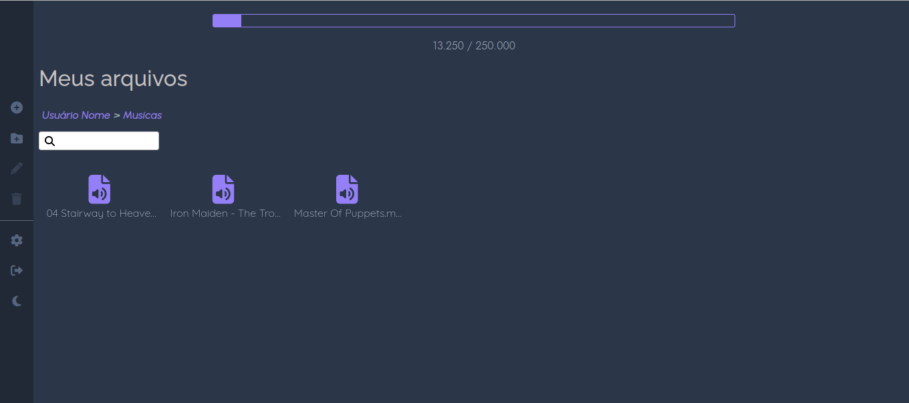

# MyBox

## Tabela de Conteúdo
- [Overview](#overview)
  - [Screenshot](#screenshot) 
- [Documentação](#documentação)
  - [Instalação](#instalação)
    - [Docker](#docker)
    - [Javascript](#javascript)

## Overview

Esse projeto foi criado com o objetivo de fazer upload de arquivos na nuvem e baixa-los quando necessário, semelhantes aos serviços do Dropbox e Google Drive.

Um resumo do projeto:
<ul>
  <li>Multiusuário</li>
  <li>Realizar CRUD através das rotas (GET, POST, PUT, DELETE)</li>
  <li>Cadastro de novo usuário</li>
  <li>Login/Autenticação JWT</li>
  <li>Upload de arquivos para o storage do firebase</li>
  <li>Editar, Excluir arquivos</li>
  <li>Criação de pastas para reparação dos arquivos</li>
  <li>Atualização em tempo real com o Realtime Database</li>
  <li>Uso de sessão para manter o usuário logado</li>
  <li>Designer responsivo</li>
  <li>Light Mode/Dark Mode</li>
</ul>

### Ferramentas utilizadas
<ul>
  <li>Javascript</li>
  <li>Node.js</li>
  <li>Express.js</li>
  <li>EJS Template Engine</li>
  <li>Dockerfile</li>
  <li>Firebase Realtime Database</li>
  <li>Firebase Store</li>
  <li>Express-session</li>
  <li>BCrypt</li>
  <li>JWT</li>
  <li>Cors</li>
  <li>.dotenv</li>
  <li>Nodemon (Auto reload)</li>
  <li>NVM (Node Version Manager) </li>
  <li>Nodemon</li>
</ul>

## Screenshot

<div>
  
  
  
<div>

## Documentação

### Instalação

Após clonar o repositório, faça os passos abaixo para os seguintes arquivos em seus respectivos diretorios:
  - ./env.example - Mude o nome do arquivo para .env
  - ./src/public/js/env.example.js - Mude o nome do arquivo para env.js
  
   
  
  Abra os 2 arquivos ('.env' e 'env.js') e adicione em ambos as configurações para apontar para seu projeto firebase. Sem isso o projeto não vai    funcionar.

#### Docker

```
sudo docker build -t mybox .
```
  Após o docker terminar de construir a imagem, execute o comando:
  
```
sudo docker run -dp 3000:3000 mybox
```

Abra o navegador no endereço: ```localhost:3000```

#### Javascript

  Instale as dependencias necessárias com o comando abaixo:

```javascript
npm install
```

Após concluír a instalação das dependências, execute o comando a seguir para iniciar o projeto.

```javascript
node server.js
```

Abra o navegador no endereço: ```localhost:3000```

